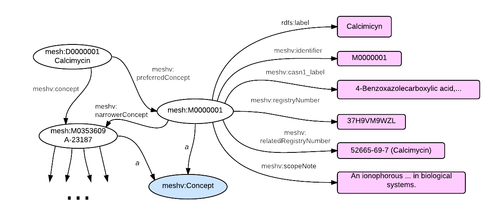

A concept is a class in MeSH RDF with the name [meshv:Concept](http://id.nlm.nih.gov/mesh/describe?uri=http%3A%2F%2Fid.nlm.nih.gov%2Fmesh%2Fvocab%23Concept){:target="_blank"}.  MeSH Concepts are all assigned 'M' identifiers.  A MeSH Concept represents a unit of meaning.
Each MeSH record consists of one or more Concepts, and each Concept consists in one or more synonymous terms.
Collections of concepts that may be useful for search and retrieval on a given topic are placed into the same MeSH Descriptor.
A concept is considered 'preferred' if its name is used by the descriptor to which it belongs.
For more information about Concepts, visit the NLM [MeSH Concept Structure page](http://www.nlm.nih.gov/mesh/concept_structure.html){:target="_blank"}.
The diagram below illustrates the relations and properties of meshv:Concept classes.

### RDF Graph Diagram

{: class="rdf-graph img-responsive"}

### meshv:Concept - Relations and Properties

{::options parse_block_html="true" /}

{: #tabs}
<div>

*  [Relations to other classes (as subject)](#tabs-1)
*  [Relations to other classes (as object)](#tabs-2)
*  [meshv:Concept properties](#tabs-3)

{: #tabs-1}
<div>

{:.data-table-long .row-border .hover }
Subject | Predicate | Object
------- | --------- | -------
meshv:Concept | meshv:broaderConcept | meshv:Concept
meshv:Concept | meshv:narrowerConcept | meshv:Concept
meshv:Concept | meshv:preferredTerm | meshv:Term
meshv:Concept | meshv:term | meshv:Term
meshv:Concept | meshv:relatedConcept | meshv:Concept

</div>

{: #tabs-2}
<div>

{:.data-table-long .row-border .hover}
Subject | Predicate | Object
------- | --------- | -------
meshv:CheckTag | meshv:preferredConcept | meshv:Concept
meshv:Concept | meshv:broaderConcept | meshv:Concept
meshv:Concept | meshv:narrowerConcept | meshv:Concept
meshv:Concept | meshv:relatedConcept | meshv:Concept
meshv:Descriptor | meshv:concept | meshv:Concept
meshv:Descriptor | meshv:preferredConcept | meshv:Concept
meshv:GeographicalDescriptor | meshv:concept | meshv:Concept
meshv:GeographicalDescriptor | meshv:preferredConcept | meshv:Concept
meshv:PublicationType | meshv:concept | meshv:Concept
meshv:PublicationType | meshv:preferredConcept | meshv:Concept
meshv:Qualifier | meshv:concept | meshv:Concept
meshv:Qualifier | meshv:preferredConcept | meshv:Concept
meshv:SCR_Chemical | meshv:concept | meshv:Concept
meshv:SCR_Chemical | meshv:preferredConcept | meshv:Concept
meshv:SCR_Disease | meshv:concept | meshv:Concept
meshv:SCR_Disease | meshv:preferredConcept | meshv:Concept
meshv:SCR_Protocol | meshv:concept | meshv:Concept
meshv:SCR_Protocol | meshv:preferredConcept | meshv:Concept
meshv:SupplementaryConceptRecord | meshv:concept | meshv:Concept
meshv:SupplementaryConceptRecord | meshv:preferredConcept | meshv:Concept
meshv:TopicalDescriptor | meshv:concept | meshv:Concept
meshv:TopicalDescriptor | meshv:preferredConcept | meshv:Concept

</div>

{: #tabs-3}
<div>
{:.data-table-long .row-border .hover}
Subject | Predicate
------- | ---------
meshv:Concept | meshv:active
meshv:Concept | meshv:identifier
meshv:Concept | meshv:lastActiveYear
meshv:Concept | meshv:casn1_label
meshv:Concept | meshv:registryNumber
meshv:Concept | meshv:relatedRegistryNumber
meshv:Concept | meshv:scopeNote
meshv:Concept | rdfs:label


</div>
</div>

### SPARQL

The RDF output shown in the diagram above can be generated with the following <span class='invoke-sparql'>SPARQL query</span>:


```sparql
prefix mesh: <http://id.nlm.nih.gov/mesh/>
prefix meshv: <http://id.nlm.nih.gov/mesh/vocab#>

construct {
    mesh:D000001 meshv:preferredConcept ?prefcon .
    ?prefcon ?p ?o .
}
from <http://id.nlm.nih.gov/mesh>
where {
    mesh:D000001 meshv:preferredConcept ?prefcon .
    ?prefcon ?p ?o .
}
```

