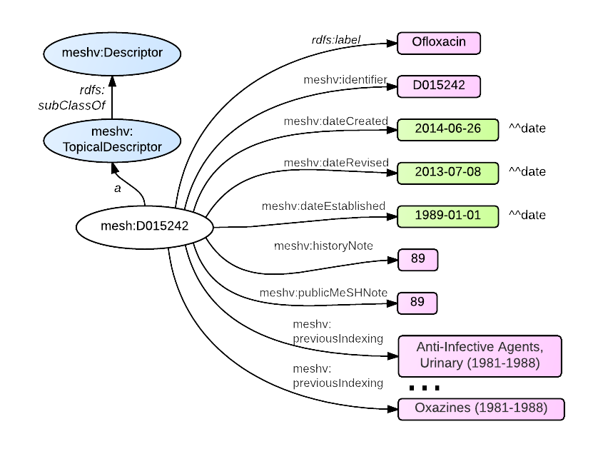

A Descriptor is a class in MeSH RDF with the name [meshv:Descriptor](http://id.nlm.nih.gov/mesh/describe?uri=http%3A%2F%2Fid.nlm.nih.gov%2Fmesh%2Fvocab%23Descriptor){:target="_blank"}.
Also known as Main Headings or MeSH Headings, Descriptors are used to index citations in the NLM MEDLINE database and to describe the subjects for NLM Catalog records.
Descriptors are searchable in PubMed and NLM Catalog with the search tag [MH]. Most Descriptors indicate the subject of a resource (including geographic terms).
Some indicate publication types (what a resource is rather than what it is about; for example: Randomized Controlled Trial or Letter).
For more information about Descriptors, visit the NLM [MeSH Record Types page](http://www.nlm.nih.gov/mesh/intro_record_types.html).

### Class Information

In MeSH RDF, the subclasses of meshv:Descriptor are:

*  meshv:TopicalDescriptor
*  meshv:PublicationType
*  meshv:CheckTag
*  meshv:GeographicalDescriptor


The chart below displays the properties and relations of the meshv:TopicalDescriptor D015242, 'Oflaxacin'. 

###RDF Graph Diagram

The following RDF graph diagram shows a fairly typical topical descriptor (D015242, Ofloxacin) and its literals. For reference, see [Ofloxacin in the MeSH browser](https://www.nlm.nih.gov/cgi/mesh/2014/MB_cgi?term=ofloxacin). The data elements featured here have literal strings as objects, not identifiers.

{: class="rdf-graph"}

### meshv:Descriptor - Relations and Properties

{::options parse_block_html="true" /}

{: #tabs}
<div>

*  [Relations to other classes (as subject)](#tabs-1)
*  [Relations to other classes (as object)](#tabs-2)
*  [Concept properties](#tabs-3)

{: #tabs-1}
<div>
{:.display}
Subject | Predicate | Object
------- | --------- | --------
meshv:TopicalDescriptor | meshv:preferredConcept | meshv:Concept
meshv:TopicalDescriptor | meshv:concept | meshv:Concept
meshv:TopicalDescriptor | meshv:allowableQualifier | meshv:Qualifier
meshv:TopicalDescriptor | &lt;http://www.w3.org/2004/02/skos/core#broader&gt; | meshv:TopicalDescriptor
meshv:TopicalDescriptor | meshv:treeNumber | meshv:TreeNumber
meshv:TopicalDescriptor | meshv:recordPreferredTerm | meshv:Term
meshv:TopicalDescriptor | meshv:pharmacologicalAction | meshv:TopicalDescriptor
meshv:TopicalDescriptor | meshv:seeAlso | meshv:TopicalDescriptor
meshv:TopicalDescriptor | &lt;http://www.w3.org/2004/02/skos/core#broader&gt; | meshv:GeographicalDescriptor
meshv:TopicalDescriptor | meshv:seeAlso | meshv:PublicationType

</div>

{: #tabs-2}
<div>
{:.display}
Subject | Predicate | Object
------- | --------- | --------
meshv:AllowedDescriptorQualifierPair | meshv:hasDescriptor | meshv:TopicalDescriptor
meshv:DisallowedDescriptorQualifierPair | meshv:hasDescriptor | meshv:TopicalDescriptor
meshv:TopicalDescriptor | &lt;http://www.w3.org/2004/02/skos/core#broader&gt; | meshv:TopicalDescriptor
meshv:TopicalDescriptor | meshv:pharmacologicalAction | meshv:TopicalDescriptor
meshv:SupplementaryConceptRecord | meshv:pharmacologicalAction | meshv:TopicalDescriptor
meshv:DisallowedDescriptorQualifierPair | meshv:useInstead | meshv:TopicalDescriptor
meshv:TopicalDescriptor | meshv:seeAlso | meshv:TopicalDescriptor
meshv:IndexingData | meshv:indexingDescriptor | meshv:TopicalDescriptor
meshv:MappedData | meshv:isMappedToDescriptor | meshv:TopicalDescriptor
meshv:GeographicalDescriptor | &lt;http://www.w3.org/2004/02/skos/core#broader&gt; | meshv:TopicalDescriptor

</div>

{: #tabs-3}
<div>
{:.display}
Subject | Predicate
------- | ---------
meshv:TopicalDescriptor | rdfs:label
meshv:TopicalDescriptor | &lt;http://purl.org/dc/terms/identifier&gt;
meshv:TopicalDescriptor | meshv:activeMeSHYear
meshv:TopicalDescriptor | meshv:dateCreated
meshv:TopicalDescriptor | meshv:dateEstablished
meshv:TopicalDescriptor | meshv:dateRevised
meshv:TopicalDescriptor | meshv:historyNote
meshv:TopicalDescriptor | meshv:onlineNote
meshv:TopicalDescriptor | meshv:recordAuthorizer
meshv:TopicalDescriptor | meshv:annotation
meshv:TopicalDescriptor | meshv:recordMaintainer
meshv:TopicalDescriptor | meshv:recordOriginator
meshv:TopicalDescriptor | meshv:previousIndexing
meshv:TopicalDescriptor | meshv:publicMeSHNote
meshv:TopicalDescriptor | meshv:runningHead
meshv:TopicalDescriptor | meshv:considerAlso

</div>
</div>

<div>

###SPARQL

The following <span class='invoke-sparql'>SPARQL query</span> will produce the predicates and objects of Ofloxacin.


```sparql
PREFIX mesh: <http://id.nlm.nih.gov/mesh/>
CONSTRUCT { mesh:D015242 ?p ?o . }
FROM <http://id.nlm.nih.gov/mesh2014>
WHERE {
  mesh:D015242 ?p ?o .
}
```

###MeSH RDF Data

Here is the truncated output of the above query in [N3 format](http://iddev.nlm.nih.gov/mesh/servlet/query?query=PREFIX%20rdf%3A%20%3Chttp%3A%2F%2Fwww.w3.org%2F1999%2F02%2F22-rdf-syntax-ns%23%3E%0D%0APREFIX%20rdfs%3A%20%3Chttp%3A%2F%2Fwww.w3.org%2F2000%2F01%2Frdf-schema%23%3E%0D%0APREFIX%20owl%3A%20%3Chttp%3A%2F%2Fwww.w3.org%2F2002%2F07%2Fowl%23%3E%0D%0APREFIX%20xsd%3A%20%3Chttp%3A%2F%2Fwww.w3.org%2F2001%2FXMLSchema%23%3E%0D%0APREFIX%20dc%3A%20%3Chttp%3A%2F%2Fpurl.org%2Fdc%2Felements%2F1.1%2F%3E%0D%0APREFIX%20dcterms%3A%20%3Chttp%3A%2F%2Fpurl.org%2Fdc%2Fterms%2F%3E%0D%0APREFIX%20dbpedia2%3A%20%3Chttp%3A%2F%2Fdbpedia.org%2Fproperty%2F%3E%0D%0APREFIX%20dbpedia%3A%20%3Chttp%3A%2F%2Fdbpedia.org%2F%3E%0D%0APREFIX%20foaf%3A%20%3Chttp%3A%2F%2Fxmlns.com%2Ffoaf%2F0.1%2F%3E%0D%0APREFIX%20skos%3A%20%3Chttp%3A%2F%2Fwww.w3.org%2F2004%2F02%2Fskos%2Fcore%23%3E%0D%0APREFIX%20meshv%3A%20%3Chttp%3A%2F%2Fid.nlm.nih.gov%2Fmesh%2Fvocab%23%3E%0D%0APREFIX%20mesh%3A%20%3Chttp%3A%2F%2Fid.nlm.nih.gov%2Fmesh%2F%3E%0D%0A%0D%0ACONSTRUCT%20%7B%20mesh%3AD015242%20%3Fp%20%3Fo%20.%20%7D%0D%0AFROM%20%3Chttp%3A%2F%2Fid.nlm.nih.gov%2Fmesh2014%3E%0D%0AWHERE%20%7B%0D%0A%20%20mesh%3AD015242%20%3Fp%20%3Fo%20.%0D%0A%7D&format=N3){:target="_blank"}. The same data is illustrated in the RDF graph diagram above.


```
<http://id.nlm.nih.gov/mesh/D015242>
        a       <http://id.nlm.nih.gov/mesh/vocab#TopicalDescriptor> ;
        <http://www.w3.org/2000/01/rdf-schema#label>
                "Ofloxacin" ;
        <http://id.nlm.nih.gov/mesh/vocab#activeMeSHYear>
                "2014-01-01"^^<http://www.w3.org/2001/XMLSchema#date> ;
                ...
        <http://id.nlm.nih.gov/mesh/vocab#dateCreated>
                "2014-06-26"^^<http://www.w3.org/2001/XMLSchema#date> ;
        <http://id.nlm.nih.gov/mesh/vocab#dateEstablished>
                "1989-01-01"^^<http://www.w3.org/2001/XMLSchema#date> ;
        <http://id.nlm.nih.gov/mesh/vocab#dateRevised>
                "2013-07-08"^^<http://www.w3.org/2001/XMLSchema#date> ;
        <http://id.nlm.nih.gov/mesh/vocab#historyNote>
                "89" ;
                ...
        <http://id.nlm.nih.gov/mesh/vocab#previousIndexing>
                "Anti-Infective Agents, Urinary (1981-1988)" ,
                ...
                "Oxazines (1981-1988)" ;
        <http://id.nlm.nih.gov/mesh/vocab#publicMeSHNote>
                "89" ;
        <http://id.nlm.nih.gov/mesh/vocab#recordAuthorizer>
                "chodan" ;
        <http://id.nlm.nih.gov/mesh/vocab#recordMaintainer>
                "pashj" ;
        <http://id.nlm.nih.gov/mesh/vocab#recordOriginator>
                "standardr" ;
        <http://id.nlm.nih.gov/mesh/vocab#recordPreferredTerm>
                <http://id.nlm.nih.gov/mesh/T044624> ;
                ...
        <http://purl.org/dc/terms/identifier>
                "D015242" ;
                ...
```

###MeSH XML

The MeSH RDF was derived from non-RDF MeSH XML. Compare the RDF graph diagram and the N3 data above to the truncated MeSH XML for Ofloxacin below.


```xml
<DescriptorRecord DescriptorClass = "1">
  <DescriptorUI>D015242</DescriptorUI>
  <DescriptorName>
   <String>Ofloxacin</String>
  </DescriptorName>
  <DateCreated>
   <Year>2014</Year>
   <Month>06</Month>
   <Day>26</Day>
  </DateCreated>
  <DateRevised>
   <Year>2013</Year>
   <Month>07</Month>
   <Day>08</Day>
  </DateRevised>
  <DateEstablished>
   <Year>1989</Year>
   <Month>01</Month>
   <Day>01</Day>
  </DateEstablished>
  <ActiveMeSHYearList>
   <Year>2014</Year>
  </ActiveMeSHYearList>
  ...
  <HistoryNote>89
  </HistoryNote>
  <PublicMeSHNote>89
  </PublicMeSHNote>
  <PreviousIndexingList>
   ...
   <PreviousIndexing>Anti-Infective Agents, Urinary (1981-1988)</PreviousIndexing>
   <PreviousIndexing>Oxazines (1981-1988)</PreviousIndexing>
  </PreviousIndexingList>
  ...
  <RecordOriginatorsList>
   <RecordOriginator>standardr</RecordOriginator>
   <RecordMaintainer>pashj</RecordMaintainer>
   <RecordAuthorizer>chodan</RecordAuthorizer>
  </RecordOriginatorsList>
  ...
 </DescriptorRecord>
```
