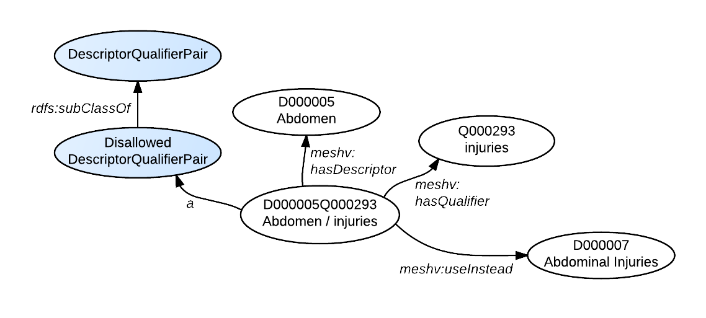

The following shows how EntryCombinations (see the [MeSH documentation](http://www.nlm.nih.gov/mesh/xml_data_elements.html#EntryCombination)) are modeled.

###RDF Graph Diagram

Depicted in this graph:

{: class="rdf-graph"}

###SPARQL

The following <span class='invoke-sparql'>SPARQL query</span> does produces the RDF corresponding
to the above graph:

```sparql
PREFIX mesh: <http://id.nlm.nih.gov/mesh/>
PREFIX meshv: <http://id.nlm.nih.gov/mesh/vocab#>

CONSTRUCT {
  ?ecin ?p ?o .
  ?ecin rdf:type ?eclass .
  ?eclass rdfs:subClassOf $superclass .
}
from <http://id.nlm.nih.gov/mesh2014>
where {
  ?ecin meshv:hasDescriptor mesh:D000005 .
  ?ecin meshv:hasQualifier ?ecinq .
  ?ecin meshv:useInstead ?ecout .
  ?ecin ?p ?o .
  ?ecin rdf:type ?eclass .
  ?eclass rdfs:subClassOf $superclass .
}
```


### MeSH RDF Data

```
@prefix rdf:  <http://www.w3.org/1999/02/22-rdf-syntax-ns#> .
@prefix mesh: <http://id.nlm.nih.gov/mesh/> .
@prefix meshv:  <http://id.nlm.nih.gov/mesh/vocab#> .
@prefix rdfs: <http://www.w3.org/2000/01/rdf-schema#> .

mesh:D000005Q000293  rdf:type  meshv:DisallowedDescriptorQualifierPair ;
  meshv:hasDescriptor  mesh:D000005 ;
  meshv:hasQualifier   mesh:Q000293 ;
  meshv:useInstead     mesh:D000007 .
meshv:DisallowedDescriptorQualifierPair rdfs:subClassOf meshv:DescriptorQualifierPair .
```

Notes:

* For *most* entry combinations, the ECOUT is just a stand-alone Descriptor, but occasionally
  it is a DescriptorQualifierPair.  The *object* of the `meshv:useInstead` property would simply be a
  DescriptorQualifierPair instance, rather than, as is depicted in the drawing above, a Descriptor.

* The DQ pair formed by the ECIN of the entry combination is never
  not one of the "allowed" ones.


### MeSH XML
Here is a typical example of and EntryCombination represented in XML.


```xml
<DescriptorRecord DescriptorClass="1">
  <DescriptorUI>D000005</DescriptorUI>
  <DescriptorName>
    <String>Abdomen</String>
  </DescriptorName>
  ...
  <EntryCombinationList>
    <EntryCombination>
      <ECIN>
        <DescriptorReferredTo>
          <DescriptorUI>D000005</DescriptorUI>
          <DescriptorName>
            <String>Abdomen</String>
          </DescriptorName>
        </DescriptorReferredTo>
        <QualifierReferredTo>
          <QualifierUI>Q000293</QualifierUI>
          <QualifierName>
            <String>injuries</String>
          </QualifierName>
        </QualifierReferredTo>
      </ECIN>
      <ECOUT>
        <DescriptorReferredTo>
          <DescriptorUI>D000007</DescriptorUI>
          <DescriptorName>
            <String>Abdominal Injuries</String>
          </DescriptorName>
        </DescriptorReferredTo>
      </ECOUT>
    </EntryCombination>
  </EntryCombinationList>
  ...
</DescriptorRecord>
```


