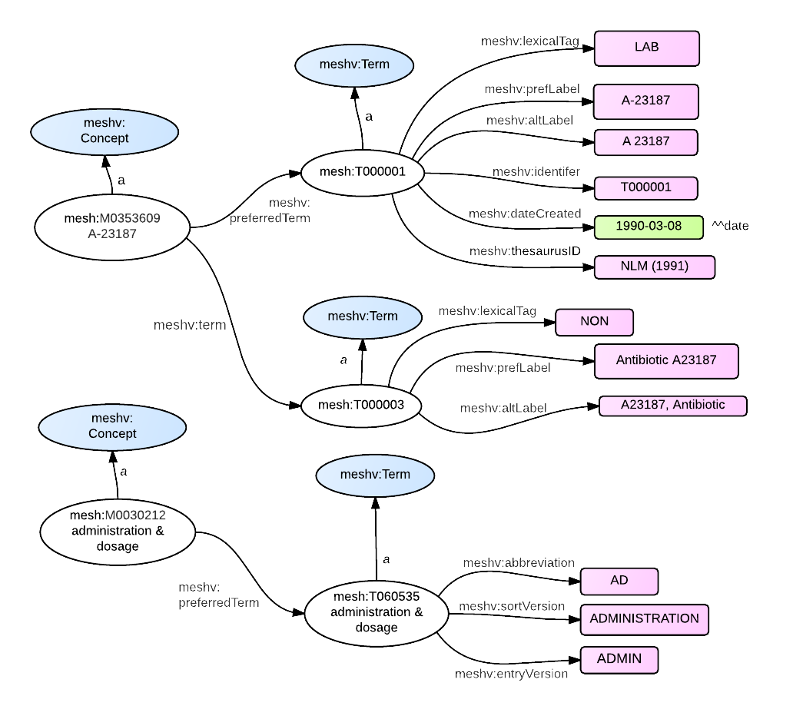

* See [issue #36](https://github.com/HHS/mesh-rdf/issues/36) for some questions that need resolving
* Also need an example for Term/Abbreviation; Term/SortVersion, and Term/EntryVersion - use T060555, which is a descendent of the *qualifier* Q000008, administration and dosage. (We'll add a drawing for this under Qualifiers)

## RDF Graph Model

Depicted in these graphs:

{: style="width: 50%"}

{: style="width: 50%"}


## XML

```xml
<DescriptorRecord DescriptorClass="1">
  <DescriptorUI>D000001</DescriptorUI>
  <DescriptorName>
    <String>Calcimycin</String>
  </DescriptorName>
  ...
  <ConceptList>
    <Concept PreferredConceptYN="Y">
      <ConceptUI>M0000001</ConceptUI>
      <ConceptName>
        <String>Calcimycin</String>
      </ConceptName>
      ...
      <TermList>
        <Term ConceptPreferredTermYN="Y" IsPermutedTermYN="N" LexicalTag="NON" PrintFlagYN="Y"
          RecordPreferredTermYN="Y">
          <TermUI>T000002</TermUI>
          <String>Calcimycin</String>
          ...
        </Term>
      </TermList>
    </Concept>
    <Concept PreferredConceptYN="N">
      <ConceptUI>M0353609</ConceptUI>
      <ConceptName>
        <String>A-23187</String>
      </ConceptName>
      ...
      <TermList>
        <Term ConceptPreferredTermYN="Y" IsPermutedTermYN="N" LexicalTag="LAB" PrintFlagYN="N"
          RecordPreferredTermYN="N">
          <TermUI>T000001</TermUI>
          <String>A-23187</String>
          <DateCreated>
            <Year>1990</Year>
            <Month>03</Month>
            <Day>08</Day>
          </DateCreated>
          <ThesaurusIDlist>
            <ThesaurusID>NLM (1991)</ThesaurusID>
          </ThesaurusIDlist>
        </Term>
        <Term ConceptPreferredTermYN="N" IsPermutedTermYN="Y" LexicalTag="LAB" PrintFlagYN="N"
          RecordPreferredTermYN="N">
          <TermUI>T000001</TermUI>
          <String>A 23187</String>
        </Term>
        <Term ConceptPreferredTermYN="N" IsPermutedTermYN="N" LexicalTag="NON" PrintFlagYN="N"
          RecordPreferredTermYN="N">
          <TermUI>T000003</TermUI>
          <String>Antibiotic A23187</String>
          ...
        </Term>
        <Term ConceptPreferredTermYN="N" IsPermutedTermYN="Y" LexicalTag="NON" PrintFlagYN="N"
          RecordPreferredTermYN="N">
          <TermUI>T000003</TermUI>
          <String>A23187, Antibiotic</String>
        </Term>
        ...
      </TermList>
    </Concept>
  </ConceptList>
</DescriptorRecord>
```


In turtle format:

```
@prefix rdf:  <http://www.w3.org/1999/02/22-rdf-syntax-ns#> .
@prefix mesh: <http://id.nlm.nih.gov/mesh/> .
@prefix meshv:  <http://id.nlm.nih.gov/mesh/vocab#> .
@prefix rdfs: <http://www.w3.org/2000/01/rdf-schema#> .
@prefix dcterms:  <http://purl.org/dc/terms/> .
@prefix xsd:  <http://www.w3.org/2001/XMLSchema#> .
@prefix skos: <http://www.w3.org/2004/02/skos/core#> .

mesh:D000001    rdf:type  meshv:TopicalDescriptor ;
                meshv:preferredConcept  mesh:M0000001 ;
                meshv:concept mesh:M0353609 ;
                meshv:preferredTerm mesh:T000002 .

mesh:M0000001   rdf:type  meshv:Concept ;
                meshv:preferredTerm mesh:T000002 .

mesh:M0353609   rdf:type  meshv:Concept ;
                meshv:term  mesh:T000003 ,
                            mesh:T000004 ;
                meshv:preferredTerm mesh:T000001 .

mesh:T000002    rdf:type  meshv:Term .

mesh:T000001    rdf:type  meshv:LabNumber ;
                meshv:lexicalTag  "LAB" ;
                rdfs:label  "A-23187" ;
                skos:prefLabel  "A-23187" ;
                skos:altLabel "A 23187" .
                dcterms:identifier  "T000001" ;
                meshv:dateCreated "1990-03-08"^^xsd:date ;
                meshv:thesaurusID "NLM (1991)" ;
                meshv:printFlag "N" ;

mesh:T000003    rdf:type  meshv:Term ;
                meshv:lexicalTag  "NON" ;
                rdfs:label  "Antibiotic A23187" ;
                skos:prefLabel  "Antibiotic A23187" ;
                skos:altLabel "A23187, Antibiotic" .
...

meshv:LabNumber rdfs:subClassOf meshv:Term .
```

Notes:

* The [LexicalTag` attribute](http://www.nlm.nih.gov/mesh/xml_data_elements.html#LexicalTag)
  in the XML representation of a Term is used to determine its class (see [issue #36](https://github.com/HHS/mesh-rdf/issues/36).
  Each of these (except the first) is a subclass of meshv:Term:

    ```
    NON   meshv:Term
    ABB   meshv:Abbreviation
    ABX   meshv:EmbeddedAbbreviation
    ACR   meshv:Acronym
    ACX   meshv:EmbeddedAcronym
    EPO   meshv:Eponym
    LAB   meshv:LabNumber
    NAM   meshv:ProperName
    TRD   meshv:TradeName
    ```

* The [RecordPreferredTermYN attribute](http://www.nlm.nih.gov/mesh/xml_data_elements.html#RecordPreferredTermYN)
  in the XML is used to directly connect a record (in this
  case, a Descriptor) to its preferred term, using the `meshv:preferredTerm` property, which is an
  `rdfs:subPropertyOf` `meshv:term`.

* The [IsPermutedTermYN
  attribute](http://www.nlm.nih.gov/mesh/xml_data_elements.html#IsPermutedTermYN) is used to determine the
  properties to use for a given label.  If IsPermutedTermYN is "N", then `skos:prefLabel` is used.
  If it is "Y", then `skos:altLabel` is used.  For convenience, the preferred label is also indicated with
  the `rdfs:label` property.

## Generating the RDF

[Note that the following should be possible using the short `CONSTRUCT WHERE` form,
as described in [the SPARQL specification](http://www.w3.org/TR/2013/REC-sparql11-query-20130321/#constructWhere),
but it seems that Virtuoso doesn't support it.]

```sparql
PREFIX mesh: <http://id.nlm.nih.gov/mesh/>
PREFIX meshv: <http://id.nlm.nih.gov/mesh/vocab#>

construct {
    mesh:D000001 a ?descClass .

    mesh:D000001 meshv:preferredConcept ?prefCon .
    ?prefCon a ?prefConClass .
    mesh:D000001 meshv:preferredTerm ?prefTerm .
    ?prefTerm a ?prefTermClass .
    ?prefCon meshv:preferredTerm ?prefTerm .

    mesh:D000001 meshv:concept ?con .
    ?con a ?conClass .
    ?con meshv:preferredTerm ?conPrefTerm .
    ?conPrefTerm a ?conPrefTermClass .
    ?conPrefTermClass rdfs:subClassOf ?conPrefTermSuperclass .

    ?con meshv:term ?conTerm .
    ?conTerm a ?conTermClass .

    ?conPrefTerm ?cptp ?cpto .

    ?conTerm ?ctp ?cto .
}
from <http://chrismaloney.org/mesh>
from <http://chrismaloney.org/meshv>
where {
    mesh:D000001 a ?descClass .

    mesh:D000001 meshv:preferredConcept ?prefCon .
    ?prefCon a ?prefConClass .
    mesh:D000001 meshv:preferredTerm ?prefTerm .
    ?prefTerm a ?prefTermClass .
    ?prefCon meshv:preferredTerm ?prefTerm .

    mesh:D000001 meshv:concept ?con .
    ?con a ?conClass .
    ?con meshv:preferredTerm ?conPrefTerm .
    ?conPrefTerm a ?conPrefTermClass .
    ?conPrefTermClass rdfs:subClassOf ?conPrefTermSuperclass .

    ?con meshv:term ?conTerm .
    ?conTerm a ?conTermClass .

    ?conPrefTerm ?cptp ?cpto .

    ?conTerm ?ctp ?cto .
}
```

At the time of this writing, you can see the results dynamically from [this url](http://jatspan.org:8890/sparql?query=PREFIX+mesh%3A+%3Chttp%3A%2F%2Fid.nlm.nih.gov%2Fmesh%2F%3E%0D%0APREFIX+meshv%3A+%3Chttp%3A%2F%2Fid.nlm.nih.gov%2Fmesh%2Fvocab%23%3E%0D%0A%0D%0Aconstruct+%7B%0D%0A++++mesh%3AD000001+a+%3FdescClass+.%0D%0A%0D%0A++++mesh%3AD000001+meshv%3ApreferredConcept+%3FprefCon+.%0D%0A++++%3FprefCon+a+%3FprefConClass+.%0D%0A++++mesh%3AD000001+meshv%3ApreferredTerm+%3FprefTerm+.%0D%0A++++%3FprefTerm+a+%3FprefTermClass+.%0D%0A++++%3FprefCon+meshv%3ApreferredTerm+%3FprefTerm+.%0D%0A%0D%0A++++mesh%3AD000001+meshv%3Aconcept+%3Fcon+.%0D%0A++++%3Fcon+a+%3FconClass+.%0D%0A++++%3Fcon+meshv%3ApreferredTerm+%3FconPrefTerm+.%0D%0A++++%3FconPrefTerm+a+%3FconPrefTermClass+.%0D%0A++++%3FconPrefTermClass+rdfs%3AsubClassOf+%3FconPrefTermSuperclass+.%0D%0A%0D%0A++++%3Fcon+meshv%3Aterm+%3FconTerm+.%0D%0A++++%3FconTerm+a+%3FconTermClass+.%0D%0A%0D%0A++++%3FconPrefTerm+%3Fcptp+%3Fcpto+.%0D%0A+%0D%0A++++%3FconTerm+%3Fctp+%3Fcto+.%0D%0A%7D%0D%0Afrom+%3Chttp%3A%2F%2Fchrismaloney.org%2Fmesh%3E%0D%0Afrom+%3Chttp%3A%2F%2Fchrismaloney.org%2Fmeshv%3E%0D%0Awhere+%7B%0D%0A++++mesh%3AD000001+a+%3FdescClass+.%0D%0A%0D%0A++++mesh%3AD000001+meshv%3ApreferredConcept+%3FprefCon+.%0D%0A++++%3FprefCon+a+%3FprefConClass+.%0D%0A++++mesh%3AD000001+meshv%3ApreferredTerm+%3FprefTerm+.%0D%0A++++%3FprefTerm+a+%3FprefTermClass+.%0D%0A++++%3FprefCon+meshv%3ApreferredTerm+%3FprefTerm+.%0D%0A%0D%0A++++mesh%3AD000001+meshv%3Aconcept+%3Fcon+.%0D%0A++++%3Fcon+a+%3FconClass+.%0D%0A++++%3Fcon+meshv%3ApreferredTerm+%3FconPrefTerm+.%0D%0A++++%3FconPrefTerm+a+%3FconPrefTermClass+.%0D%0A++++%3FconPrefTermClass+rdfs%3AsubClassOf+%3FconPrefTermSuperclass+.%0D%0A%0D%0A++++%3Fcon+meshv%3Aterm+%3FconTerm+.%0D%0A++++%3FconTerm+a+%3FconTermClass+.%0D%0A%0D%0A++++%3FconPrefTerm+%3Fcptp+%3Fcpto+.%0D%0A+%0D%0A++++%3FconTerm+%3Fctp+%3Fcto+.%0D%0A%7D&format=TURTLE)

