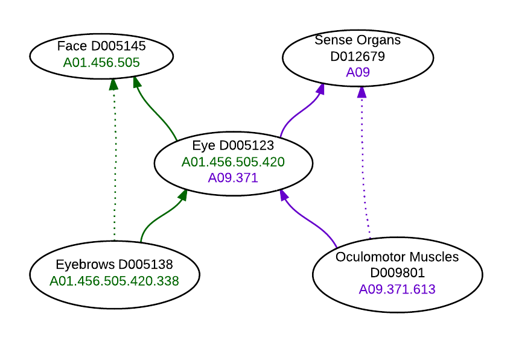
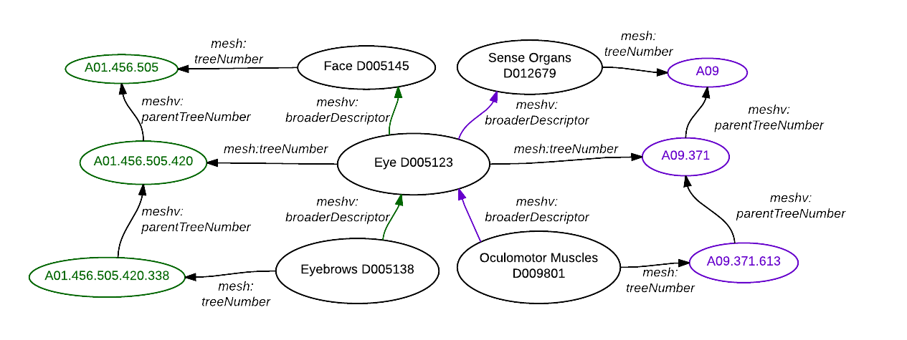

MeSH descriptors are organized into 16 categories, each of which is further divided into sub-categories to assist in more specific classification of a descriptor.
A given MeSH descriptor often has more than one tree number assigned to it.
In MeSH RDF, tree numbers are both classes in their own right (meshv:TreeNumber),  as well as properties of a meshv:Descriptor via the meshv:treeNumber predicate.
meshv:TreeNumber classes are related to each other via the meshv:broaderTransitive relationship.  One can use the '+' operator (meshv:broaderTransitive+) to
perform subsumption queries on meshv:TreeNumber.  This allows recursive discovery of ancestors or descendants of a meshv:Descriptor (see the [Sample Queries](http://hhs.github.io/meshrdf/sample-queries.html) page for
examples).  More information about MeSH Tree Numbers is available in the [MeSH documentation](http://www.nlm.nih.gov/mesh/intro_trees.html).

### RDF Graph Diagram

In this particular example, 'Eye' belongs to both the 'Body Regions' tree (A01) and the 'Sense Organs' tree (A09).

{: class="rdf-graph img-responsive"}

To account for the fact that MeSH Descriptors can belong to multiple trees, MeSH RDF represents tree numbers a proper class called meshv:TreeNumber.
As mentioned earlier, users can leverage the meshv:broaderTransitive+ to subsumptively 'explode' up and down the trees to which MeSH descriptors belong.
For example, <span class = "invoke-sparql">this query</span> retrieves all ancestors of 'Eyebrow' (in both of its trees).

{::comment} This graph needs edited to get updated predicates {: class="rdf-graph img-responsive"}{:/comment}


```sparql
PREFIX mesh: <http://id.nlm.nih.gov/mesh/>
PREFIX meshv: <http://id.nlm.nih.gov/mesh/vocab#>
PREFIX rdfs: <http://www.w3.org/2000/01/rdf-schema#>

SELECT ?treeNode ?ancestorTreeNode ?ancestor ?alabel
FROM <http://id.nlm.nih.gov/mesh2014>

WHERE {
mesh:D005138 meshv:treeNumber ?treeNode .
?treeNode meshv:broaderTransitive+ ?ancestorTreeNode .
?ancestor meshv:treeNumber ?ancestorTreeNode .
?ancestor rdfs:label ?alabel
}

ORDER BY ?treeNode ?ancestorTreeNode
```

### meshv:TreeNumber - Relations and Properties

{::options parse_block_html="true" /}

{: #tabs}
<div>

*  [Relations to other classes (as subject)](#tabs-1)
*  [Relations to other classes (as object)](#tabs-2)
*  [meshv:TreeNumber properties](#tabs-3)

{: #tabs-1}
<div>

{:.data-table-long .row-border .hover }
Subject | Predicate | Object
------- | --------- | -------
meshv:TreeNumber | meshv:broaderTransitive | meshv:TreeNumber

</div>

{: #tabs-2}
<div>

{:.data-table-long .row-border .hover}
Subject | Predicate | Object
------- | --------- | -------
meshv:Descriptor | meshv:treeNumber | meshv:TreeNumber
meshv:GeographicalDescriptor | meshv:treeNumber | meshv:TreeNumber
meshv:PublicationType | meshv:treeNumber | meshv:TreeNumber
meshv:Qualifier | meshv:allowedTreeNode | meshv:TreeNumber
meshv:Qualifier | meshv:treeNumber | meshv:TreeNumber
meshv:TopicalDescriptor | meshv:treeNumber | meshv:TreeNumber
meshv:TreeNumber | meshv:broaderTransitive | meshv:TreeNumber

</div>

{: #tabs-3}
<div>
{:.data-table-long .row-border .hover}
Subject | Predicate
------- | ---------
meshv:TreeNumber | rdfs:label

</div>
</div>

### SPARQL

Users can also discover immediate narrower/broader meshv:Descriptors via the meshv:broaderTransitive predicate.
The following <span class='invoke-sparql'>SPARQL query</span> creates a table that shows the relationships between "Eye"
and each of the immediate broader and narrower concepts for each of its tree numbers:

```sparql

PREFIX mesh: <http://id.nlm.nih.gov/mesh/>
PREFIX meshv: <http://id.nlm.nih.gov/mesh/vocab#>

SELECT *
FROM <http://id.nlm.nih.gov/mesh2014>
WHERE {
 mesh:D005123 meshv:treeNumber ?tree_number .

  {
    SELECT ?tree_number
           ?broader_tree_number ?broader_descriptor
           ?narrower_tree_number ?narrower_descriptor
    WHERE {
      ?tree_number meshv:broaderTransitive ?broader_tree_number .
      ?broader_descriptor meshv:treeNumber ?broader_tree_number .
      mesh:D005123 meshv:broader ?broader_descriptor .

      ?narrower_tree_number meshv:broaderTransitive ?tree_number .
      ?narrower_descriptor meshv:treeNumber ?narrower_tree_number .
      ?narrower_descriptor meshv:broader mesh:D005123 .
    }
  }
}

```
The <span class='invoke-sparql'>SPARQL query</span> below outputs the RDF graph of the previous query, using the CONSTRUCT clause.

```sparql
PREFIX mesh: <http://id.nlm.nih.gov/mesh/>
PREFIX meshv: <http://id.nlm.nih.gov/mesh/vocab#>

CONSTRUCT {
  mesh:D005123 meshv:treeNumber ?tree_number .
  ?tree_number meshv:broaderTransitive ?broader_tree_number .
  ?broader_descriptor meshv:treeNumber ?broader_tree_number .
  mesh:D005123 meshv:broader ?broader_descriptor .

  ?narrower_tree_number meshv:broaderTransitive ?tree_number .
  ?narrower_descriptor meshv:treeNumber ?narrower_tree_number .
  ?narrower_descriptor meshv:broader mesh:D005123 .
}
from <http://id.nlm.nih.gov/mesh2014>
where {
  mesh:D005123 meshv:treeNumber ?tree_number .

  {
    select ?tree_number
           ?broader_tree_number ?broader_descriptor
           ?narrower_tree_number ?narrower_descriptor
    where {
      ?tree_number meshv:broaderTransitive ?broader_tree_number .
      ?broader_descriptor meshv:treeNumber ?broader_tree_number .
      mesh:D005123 meshv:broader ?broader_descriptor .

      ?narrower_tree_number meshv:broaderTransitive ?tree_number .
      ?narrower_descriptor meshv:treeNumber ?narrower_tree_number .
      ?narrower_descriptor meshv:broader mesh:D005123 .
    }
  }
}
```

### MeSH RDF

```
@prefix mesh: <http://id.nlm.nih.gov/mesh/> .
@prefix meshv:  <http://id.nlm.nih.gov/mesh/vocab#> .
...
# Eye
<http://id.nlm.nih.gov/mesh/D005123>
        <http://id.nlm.nih.gov/mesh/vocab#broader>
                <http://id.nlm.nih.gov/mesh/D005145> , 
                <http://id.nlm.nih.gov/mesh/D012679> ;
        <http://id.nlm.nih.gov/mesh/vocab#treeNumber>
                <http://id.nlm.nih.gov/mesh/A09.371> , 
                <http://id.nlm.nih.gov/mesh/A01.456.505.420> .
...
# Eyebrows
<http://id.nlm.nih.gov/mesh/D005138>
        <http://id.nlm.nih.gov/mesh/vocab#broader>
                <http://id.nlm.nih.gov/mesh/D005123> ;
        <http://id.nlm.nih.gov/mesh/vocab#treeNumber>
                <http://id.nlm.nih.gov/mesh/A01.456.505.420.338> .
...
# Face
<http://id.nlm.nih.gov/mesh/D005145>
        <http://id.nlm.nih.gov/mesh/vocab#treeNumber>
                <http://id.nlm.nih.gov/mesh/A01.456.505> .
...
# Oculomotor Muscles
<http://id.nlm.nih.gov/mesh/D005123>
        <http://id.nlm.nih.gov/mesh/vocab#broader>
                <http://id.nlm.nih.gov/mesh/D005145> , 
                <http://id.nlm.nih.gov/mesh/D012679> ;
        <http://id.nlm.nih.gov/mesh/vocab#treeNumber>
                <http://id.nlm.nih.gov/mesh/A09.371> , 
                <http://id.nlm.nih.gov/mesh/A01.456.505.420> .
...
# Sense Organs
<http://id.nlm.nih.gov/mesh/D012679>
        <http://id.nlm.nih.gov/mesh/vocab#treeNumber>
                <http://id.nlm.nih.gov/mesh/A09> .
...
# Relations among TreeNumbers
<http://id.nlm.nih.gov/mesh/A01.456.505.420>
        <http://id.nlm.nih.gov/mesh/vocab#broaderTransitive>
                <http://id.nlm.nih.gov/mesh/A01.456.505> .
...
<http://id.nlm.nih.gov/mesh/A09.371>
        <http://id.nlm.nih.gov/mesh/vocab#broaderTransitive>
                <http://id.nlm.nih.gov/mesh/A09> .
...
<http://id.nlm.nih.gov/mesh/A01.456.505.420.338>
        <http://id.nlm.nih.gov/mesh/vocab#broaderTransitive>
                <http://id.nlm.nih.gov/mesh/A01.456.505.420> .
...
<http://id.nlm.nih.gov/mesh/A09.371.613>
        <http://id.nlm.nih.gov/mesh/vocab#broaderTransitive>
                <http://id.nlm.nih.gov/mesh/A09.371> .
```

### MeSH XML

The MeSH RDF was derived from non-RDF MeSH XML. Compare the RDF graph diagram and the RDF data above to the truncated MeSH XML below.

```xml
<DescriptorRecordSet LanguageCode="eng">

  <DescriptorRecord DescriptorClass="1">
    <DescriptorUI>D005123</DescriptorUI>
    <DescriptorName>
      <String>Eye</String>
    </DescriptorName>
    ...
    <TreeNumberList>
      <TreeNumber>A01.456.505.420</TreeNumber>
      <TreeNumber>A09.371</TreeNumber>
    </TreeNumberList>
    ...
  </DescriptorRecord>

  <DescriptorRecord DescriptorClass="1">
    <DescriptorUI>D005145</DescriptorUI>
    <DescriptorName>
      <String>Face</String>
    </DescriptorName>
    ...
    <TreeNumberList>
      <TreeNumber>A01.456.505</TreeNumber>
    </TreeNumberList>
    ...
  </DescriptorRecord>

  <DescriptorRecord DescriptorClass="1">
    <DescriptorUI>D005138</DescriptorUI>
    <DescriptorName>
      <String>Eyebrows</String>
    </DescriptorName>
    ...
    <TreeNumberList>
      <TreeNumber>A01.456.505.420.338</TreeNumber>
      <TreeNumber>A17.360.296</TreeNumber>
    </TreeNumberList>
    ...
  </DescriptorRecord>

  <DescriptorRecord DescriptorClass="1">
    <DescriptorUI>D009801</DescriptorUI>
    <DescriptorName>
      <String>Oculomotor Muscles</String>
    </DescriptorName>
    ...
    <TreeNumberList>
      <TreeNumber>A02.633.567.700</TreeNumber>
      <TreeNumber>A09.371.613</TreeNumber>
    </TreeNumberList>
    ...
  </DescriptorRecord>

  <DescriptorRecord DescriptorClass="1">
    <DescriptorUI>D012679</DescriptorUI>
    <DescriptorName>
      <String>Sense Organs</String>
    </DescriptorName>
    ...
    <TreeNumberList>
      <TreeNumber>A09</TreeNumber>
    </TreeNumberList>
    ...
  </DescriptorRecord>

</DescriptorRecordSet>
```

